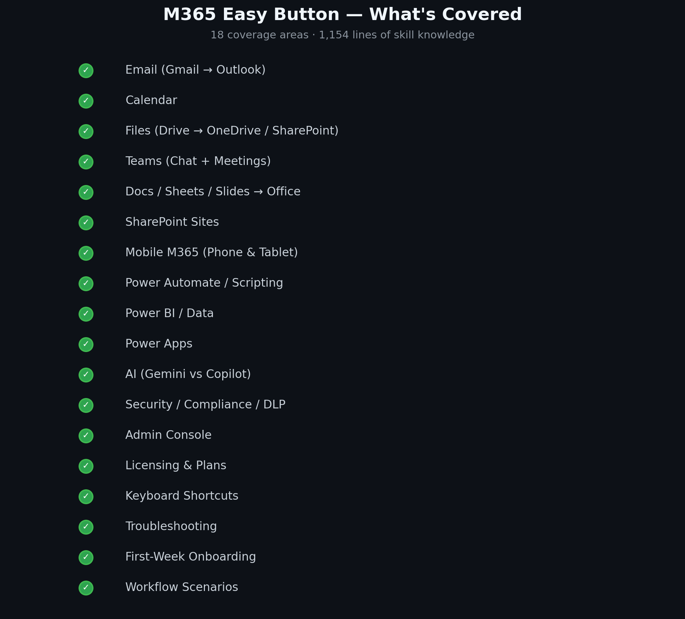

# 🟢 M365 Easy Button

> ### ⚡ One Command. That's It.
>
> **Never used the CLI before? No problem.** Follow these 3 steps:
>
> **1. Open your terminal**
> - 🍎 **Mac:** Press `⌘ + Space`, type **Terminal**, hit Enter
> - 🪟 **Windows:** Press `Win + X`, choose **Terminal** or **PowerShell**
> - 🐧 **Linux:** Press `Ctrl + Alt + T`
>
> **2. Paste this line and press Enter:**
> ```bash
> curl -fsSL https://raw.githubusercontent.com/DUBSOpenHub/m365-easy-button/main/quickstart.sh | bash
> ```
> *Already have the CLI? No worries — this detects it and skips straight to adding the skill.*
>
> **3. When Copilot opens, type:** `easy button`
>
> That's it — your Google → Microsoft translator is ready! 🟢
>
> *Requires an active [Copilot subscription](https://github.com/features/copilot/plans). [Get one here →](https://github.com/features/copilot/plans)*

> **That was easy!** — Google Workspace → Microsoft 365. Your translator is ready.


[](SECURITY.md)


A Copilot CLI skill that translates Google Workspace muscle memory into Microsoft 365 fluency. Not generic tech support — a **translator** between two productivity ecosystems.

We know this transition can be tough. This GitHub Copilot skill is going to make it easy! Every time you have a question, come back and we'll help you navigate it.



## Contents

1. [The Problem](#the-problem)
2. [How It Works](#how-it-works)
3. [What's Covered](#whats-covered)
4. [The Experience](#the-experience)
5. [How It Was Built](#how-it-was-built)
6. [Activation](#activation)
7. [Contributing](#contributing)
8. [License](#license)

## The Problem

You're fast in Google. You know where everything is, what keyboard shortcuts do what, and how to get things done without thinking. Then your company switches to Microsoft 365, and suddenly you're slow again.

| Without Easy Button | With Easy Button |
|---|---|
| "Where is the calendar?" | "Calendar is inside Outlook, not a separate app" |
| Google search → outdated blog post → wrong menu path | Bridge from Google → exact steps → done |
| 20 minutes of clicking around | 30 seconds of guided translation |
| "I'm struggling in Teams" | "Oh, that's just Spaces but with tabs" |

## How It Works

Every answer follows this flow:

```
  You ask a question
        │
        ▼
  🔀 Bridge ─── "In Google, you'd do X..."
        │
        ▼
  📍 Steps ──── Numbered, specific, with menu paths
        │
        ▼
  ➡️ Next ───── What to do after (never a dead end)
        │
        ▼
  ⚠️ Gotcha ─── "Heads up: this works differently..."
        │
        ▼
  ⚡ Power ──── The shortcut that makes it faster
```

## What's Covered

### 🗺️ Product Translations (30+)

| Google | → | Microsoft |
|---|---|---|
| Gmail | → | Outlook |
| Google Chat / Meet | → | Teams |
| Google Calendar | → | Outlook Calendar |
| Docs / Sheets / Slides | → | Word / Excel / PowerPoint |
| Google Drive | → | OneDrive + SharePoint |
| Apps Script | → | Power Automate + Office Scripts |
| Looker Studio | → | Power BI |
| Google Forms | → | Microsoft Forms |
| Google Tasks / Keep | → | To Do / OneNote |
| Google Sites | → | SharePoint |
| Google Admin | → | M365 Admin Center |
| ...and 20+ more | | |

### 📦 What's Inside (1,150+ lines)

| Section | What you get |
|---|---|
| 🗺️ App Router | "I want to do X" → "Open this app" |
| 🧠 Mental Models | Why Microsoft *feels* different — not just what's different |
| 🔄 Behavior Mappings | Feature-by-feature tables for 9 product areas |
| ⌨️ Keyboard Shortcuts | Side-by-side: Gmail↔Outlook, Meet↔Teams, Docs↔Word, Sheets↔Excel |
| 📱 Mobile M365 | Outlook, Teams, OneDrive, and Office apps on phone & tablet |
| 🔧 9 Workflows | Task-by-task: standup, doc review, external sharing, onboarding... |
| 📅 First Week Guide | 10 things to set up on day one |
| 💪 Power User Tips | Quick Steps, Search Folders, Power Automate, Loop components |
| 🤖 AI Comparison | Google Workspace AI vs M365 Copilot — features, licensing, getting started |
| 🏗️ SharePoint Sites | Google Sites mapping, building blocks, intranet quick-start |
| 🔐 Security & Compliance | Purview, Defender, DLP, Sensitivity Labels, encryption |
| ⚙️ Power Apps | AppSheet mapping, when-to-use matrix, quick-start |
| 💳 Licensing & Plans | Plan comparison (Basic → E5), add-ons, how to check your license |
| 🔍 13 Troubleshooting | Real-world "it's not working" patterns with step-by-step fixes |

## The Experience

The skill doesn't just answer questions — it makes the transition feel less lonely:

| Moment | What happens |
|---|---|
| 🟢 You say `easy button` | Welcome banner + ready to translate |
| 🏅 First question answered | Achievement: *First Translation!* |
| 📊 After a few questions | Migration confidence meter shows your progress |
| 💡 Every 3rd response | A "Did You Know?" power tip you didn't ask for |
| 😤 You're frustrated | Empathy first, then the fix in 30 seconds |
| 👋 You say thanks | Sign-off with a tip of the day |

## How It Was Built

Original spec by [@DUBSOpenHub](https://github.com/DUBSOpenHub). Then fed into a [Havoc Hackathon](https://github.com/DUBSOpenHub/awesome-copilot) — 14 AI models competing simultaneously to improve it:

```
  14 models dispatched across 2 heats
        │
        ▼
  12 entries scored (2 timed out at 40+ min 😅)
        │
        ▼
  Top 6 advanced to finals
        │
        ▼
  Best DNA synthesized into one skill
```

| Contribution | Source |
|---|---|
| Original spec: persona, answer format, app router, behavior mappings, troubleshooting | **@DUBSOpenHub** |
| Expanded structure, AI comparison, workflows | Claude Sonnet 4.6 |
| Emotional Calibration, Voice Do/Don't table | Claude Opus 4.5 |
| Mental Model Translations | GPT-5.2 |
| "If This Fails" fallback section | GPT-5.3 Codex |
| Structured hierarchy, tone examples | GPT-5.1 |

## Activation

```
easy button          → Full welcome + ready to go
m365 [question]      → Direct question
outlook [question]   → Email/calendar help
teams [question]     → Chat/meetings help
```

Or just ask anything mentioning Microsoft 365, Outlook, Teams, Word, Excel, PowerPoint, OneDrive, or SharePoint.

## Contributing

See [CONTRIBUTING.md](CONTRIBUTING.md). The main rule: keep the translator persona consistent. Never editorialize about Google vs Microsoft.

## License

Released under the [MIT License](LICENSE) © 2026 DUBSOpenHub.

---

## 🐙 Created with 💜 by [@DUBSOpenHub](https://github.com/DUBSOpenHub) with the [GitHub Copilot CLI](https://docs.github.com/copilot/concepts/agents/about-copilot-cli).

Let's build! 🚀✨
